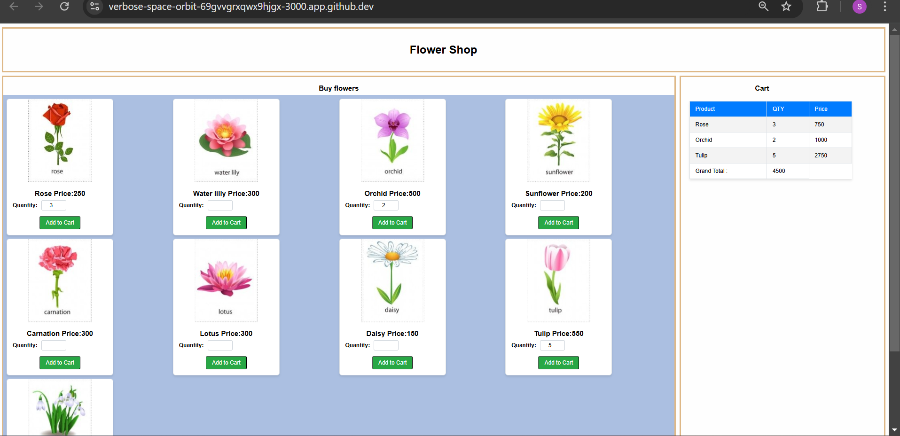

# Ecommerce_ica01

Requirements
1. On the left side, display the flowers, their image, name, and price.   
2. The buyer should able to enter the quantity of flower needed and add it to the cart.
3. On the right side, display a shopping cart table which contains the flower name, 
quantity, the total price of each flower and finally the total of the whole purchase. 

Technology: React 
Editor: VS code.

This is the output of code

